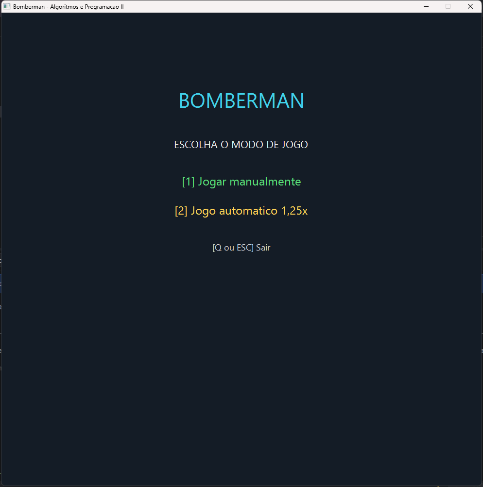
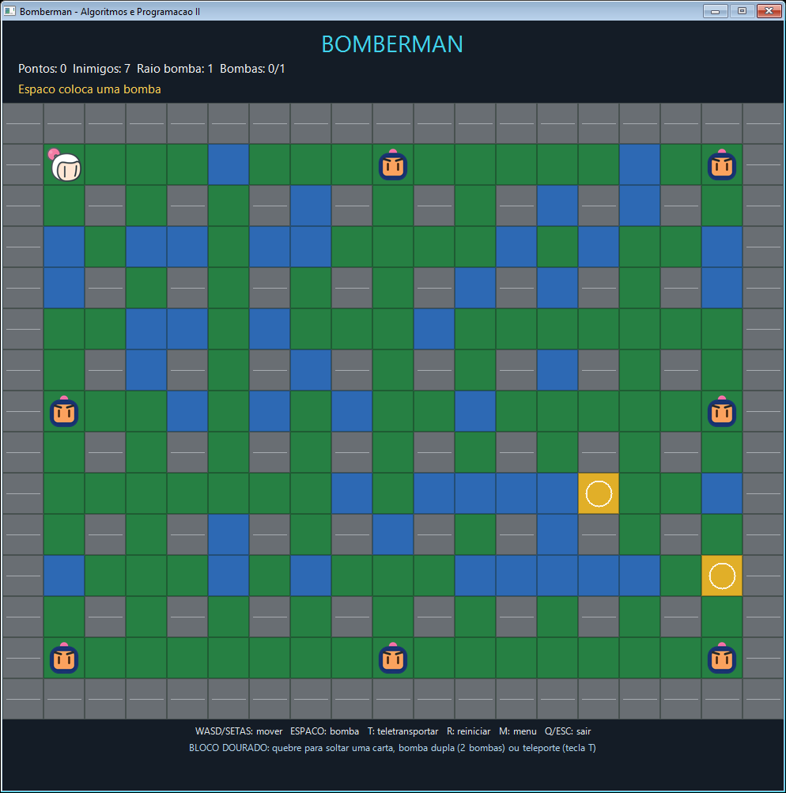
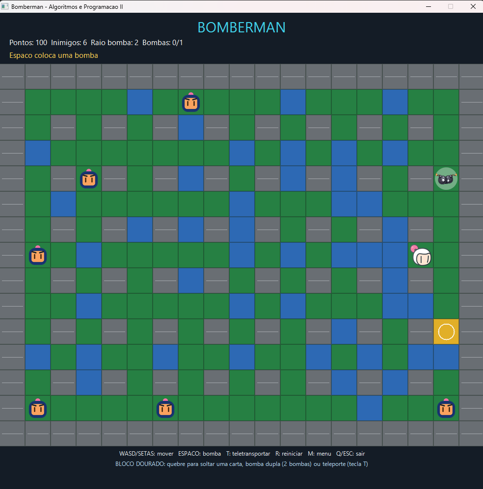
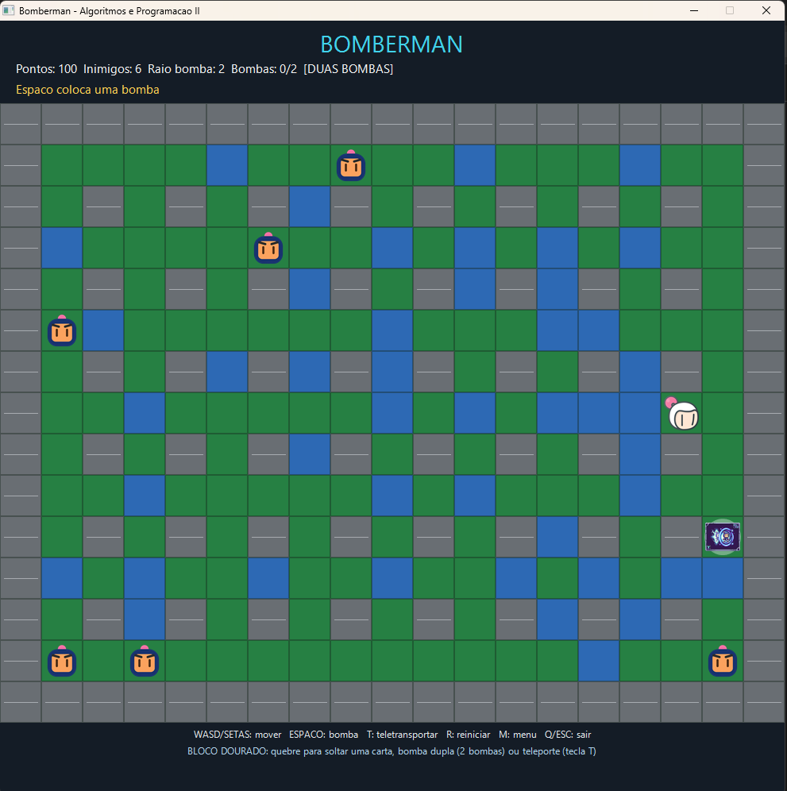

# Bomberman: Algoritmos e Programação II

Trabalho M1 da disciplina de Algoritmos e Programação II da UNIVALI, desenvolvido por Diego Silva e Gabriel Bianchessi.

O jogo usa uma janela nativa do Windows. A lógica continua em C++ com matriz, structs, vetores e sub-rotinas; a apresentação usa Win32, GDI e GDI+ para desenhar o mapa e os sprites PNG com transparência.

## Tecnologias da interface gráfica

O projeto não utiliza motor gráfico. Unity, Unreal, Godot, GLUT, SDL e SFML não fazem parte da aplicação. A interface foi construída diretamente com recursos nativos do Windows, divididos em três responsabilidades.

### Win32 API: janela, teclado, tempo e eventos

A Win32 API fornece a estrutura básica da aplicação:

- `WinMain()` é o ponto de entrada da versão gráfica e registra a classe da janela;
- `CreateWindowExW()` cria a janela principal com título, borda e tamanho calculado;
- `processarMensagem()` recebe as mensagens enviadas pelo Windows;
- `WM_KEYDOWN` informa quando uma tecla de controle foi pressionada;
- `WM_TIMER` atualiza periodicamente a lógica do jogo;
- `WM_PAINT` solicita que o conteúdo da janela seja redesenhado;
- `WM_DPICHANGED` reajusta a janela quando ela muda para uma tela com outra escala;
- `WM_DESTROY` encerra o timer, libera os assets e finaliza a aplicação;
- `GetMessageW()`, `TranslateMessage()` e `DispatchMessageW()` formam o loop de mensagens.

O timer não contém as regras do jogo. Ele calcula o tempo transcorrido e chama `atualizar()`, que continua responsável por bomba, inimigos, colisões, vitória, derrota e modo automático. Assim, a API do Windows coordena quando atualizar e desenhar, mas não decide o gameplay.

### GDI: formas geométricas e buffer duplo

GDI é a parte tradicional da API gráfica do Windows. Neste projeto, ela fornece os contextos e bitmaps necessários para montar cada quadro fora da tela:

1. `BeginPaint()` entrega o contexto de desenho da janela;
2. `CreateCompatibleDC()` cria um contexto de memória;
3. `CreateCompatibleBitmap()` cria um bitmap com o tamanho da área útil;
4. todo o HUD, mapa, formas e sprites é desenhado primeiro nesse bitmap;
5. `BitBlt()` copia o quadro pronto para a janela em uma única operação;
6. os objetos temporários são restaurados e liberados com `DeleteObject()` e `DeleteDC()`.

Esse processo é chamado de **buffer duplo**. Sem ele, o usuário poderia enxergar a janela sendo apagada e redesenhada por partes, produzindo flickering. O mapa básico também usa retângulos e linhas: chão verde, parede sólida cinza, parede frágil azul, explosão laranja e grade de separação.

### GDI+: PNG, alpha e qualidade de escala

GDI+ complementa o GDI com suporte simples a imagens PNG e transparência:

- `GdiplusStartup()` inicializa a biblioteca uma vez antes da janela;
- `Gdiplus::Image` carrega `bomberman.png`, `perfil.png` e `bomba.png`;
- os objetos ficam armazenados em `unique_ptr` e são reutilizados em todos os quadros;
- `DrawImage()` desenha o PNG preservando o canal alpha;
- `InterpolationModeHighQualityBicubic` melhora a redução das imagens originais;
- `GdiplusShutdown()` encerra a biblioteca depois que a janela fecha.

`desenharSpriteNaCelula()` calcula um único fator de escala:

```text
escala = min(largura disponível / largura original,
             altura disponível / altura original)
```

O mesmo fator é aplicado à largura e à altura. Depois, a função calcula o espaço restante e centraliza o sprite, mantendo uma margem de quatro unidades-base. Isso evita achatamento, alongamento, corte e desalinhamento. O alpha original produz o fundo transparente ao redor do personagem, do inimigo e da bomba.

### Relação com a lógica da disciplina

Win32, GDI e GDI+ formam somente a camada de entrada e apresentação. O mapa continua em uma matriz, as entidades continuam em structs e vetores, e as regras continuam implementadas nas sub-rotinas do próprio projeto. A renderização consulta o estado atual, mas não altera as regras de colisão, explosão ou movimentação.

## Pré-requisitos

- Windows 10 ou Windows 11;
- GCC/G++ com suporte a C++17 (recomendado: MSYS2 UCRT64);
- PowerShell;
- nenhuma biblioteca externa: GDI e GDI+ fazem parte do Windows.

## Como compilar

No PowerShell, dentro da pasta do projeto:

```powershell
powershell -ExecutionPolicy Bypass -File .\compilar.ps1
```

`compilar.ps1` é a forma recomendada de compilar: ele localiza o `g++` no `Path` ou na instalação
MSYS2, usa C++17 com otimização e avisos, gera `bomberman.exe` na pasta do projeto e informa um
erro claro se a compilação falhar.

O comando equivalente é:

```powershell
g++ -std=c++17 -O2 -Wall -Wextra -pedantic bomberman.cpp -o bomberman.exe -lgdiplus -mwindows
```

Se `g++` não estiver no `Path`, o script tenta automaticamente `C:\msys64\ucrt64\bin\g++.exe`. Caso precise instalar o compilador, abra o terminal MSYS2 UCRT64 e execute:

```bash
pacman -Syu
pacman -S --needed mingw-w64-ucrt-x86_64-gcc
```

Se a compilação informar que `bomberman.exe` está em uso, feche uma instância anterior do jogo e tente novamente.

## Como executar

```powershell
.\bomberman.exe
```

O tabuleiro tem 15×19 células de 52×52 unidades, mais cabeçalho e rodapé: 988×974 unidades de área útil em escala de 100%.

O programa é DPI-aware e, antes de criar a janela, `ajustarEscalaParaCaberNaTela()` compara o tamanho pedido com a área de trabalho do monitor. Se não couber, por exemplo em um notebook com escala de 125% ou 150%, a escala é reduzida automaticamente até o jogo caber inteiro. Assim o rodapé, onde aparecem as mensagens de vitória e derrota, nunca fica fora da tela.

Os assets são procurados relativamente ao executável:

- `assets/bomberman.png`: jogador;
- `assets/perfil.png`: inimigos;
- `assets/bomba.png`: bomba;
- `assets/duas_bombas.png`: carta que libera a segunda bomba;
- `assets/teleport.png`: carta de teleporte.

Eles são carregados uma única vez na inicialização. Se algum arquivo não estiver disponível, o jogo informa o caminho e desenha duas letras no lugar do sprite, sem encerrar inesperadamente.

## Menu e controles

### Telas do jogo

Menu inicial:



Partida recém-iniciada, com os sete inimigos e os dois blocos dourados:



Carta de duas bombas no chão:



Carta de teleporte no chão após a coleta da carta de duas bombas:



| Tecla | Ação |
| --- | --- |
| `1` no menu | Iniciar modo manual |
| `2` no menu | Iniciar modo automático 1,25x |
| `W`, `A`, `S`, `D` ou setas | Movimentar o jogador |
| `Espaço` | Colocar uma bomba |
| `T` | Teletransportar o jogador (precisa da carta de teleporte) |
| `R` | Reiniciar a partida |
| `M` | Voltar ao menu |
| `Q` ou `Esc` | Encerrar o jogo |

No modo automático, o jogador usa busca em largura para procurar inimigos e paredes frágeis, coloca bombas, tenta fugir da área de explosão e reinicia automaticamente após uma derrota.

## Cartas especiais

Dois blocos dourados nascem escondidos entre as paredes frágeis. Ao quebrá-los com uma bomba, a carta cai no chão e basta pisar em cima:

| Carta | Efeito |
| --- | --- |
| Duas bombas | O jogador passa a poder ter **duas bombas** no cenário ao mesmo tempo, pelo resto da partida. Sem a carta vale a regra do enunciado: uma bomba por vez. |
| Teleporte | Teletransporta o jogador uma vez para uma célula livre sorteada, com a tecla `T`. |

As duas são extras além do enunciado. O limite começa em `MAX_BOMBAS_INICIAL` (1) e volta a esse valor a cada reinício de partida.

## Elementos visuais

| Elemento | Representação |
| --- | --- |
| Jogador | Sprite `bomberman.png` |
| Inimigo | Sprite `perfil.png` |
| Bomba | Sprite `bomba.png` |
| Chão | Retângulo verde |
| Parede sólida | Retângulo cinza com detalhe |
| Parede frágil | Retângulo azul |
| Explosão | Retângulo laranja |
| Bloco bônus | Retângulo dourado com círculo |
| Cartas no chão | Sprites `duas_bombas.png` e `teleport.png` sobre um halo claro |

`desenharSpriteNaCelula()` preserva a proporção original, aplica margem e centraliza o PNG. A escala usada é o menor valor entre a largura e a altura disponíveis, evitando corte ou deformação. A tela inteira é montada em um buffer secundário e copiada de uma vez para a janela, reduzindo flickering.

## Organização do código

- `TipoCelula`, `EstadoJogo` e `ModoJogo` representam os estados principais;
- `Posicao`, `Inimigo` e `Bomba` agrupam os dados das entidades;
- `mapa[LINHAS][COLUNAS]` mantém o cenário em uma matriz fixa;
- `vector<Inimigo>` e `vector<Posicao>` guardam inimigos e células da explosão;
- `criarMapa()`, `moverJogador()`, `moverInimigos()`, `colocarBomba()`, `iniciarExplosao()`, `atualizarBombas()` e `atualizarBot()` preservam a lógica do jogo;
- `escalaQueCabe()` e `ajustarEscalaParaCaberNaTela()` mantêm a janela dentro da tela disponível;
- `carregarAssets()` e `liberarAssets()` controlam o ciclo de vida dos PNGs;
- `desenharMapa()`, `desenharTerrenoCelula()`, `desenharExplosaoOverlay()`, `desenharHUD()` e `desenharSpriteNaCelula()` cuidam somente da apresentação;
- `processarMensagem()` recebe teclado, timer, pintura, DPI e fechamento da janela.

## Arquivos

- `bomberman.cpp`: fonte oficial do jogo;
- `assets/`: sprites PNG;
- `compilar.ps1`: compilação reproduzível;
- `docs/`: enunciado do trabalho;
- `README.md`: instruções do projeto.

O arquivo `bomberman.exe` é gerado localmente e não precisa ser versionado.
